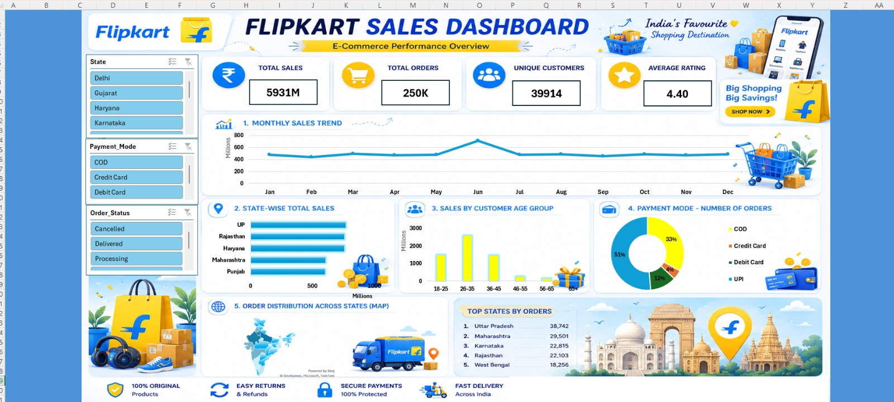
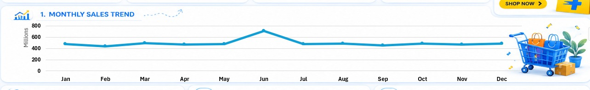
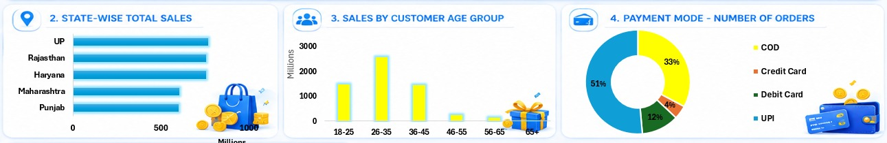
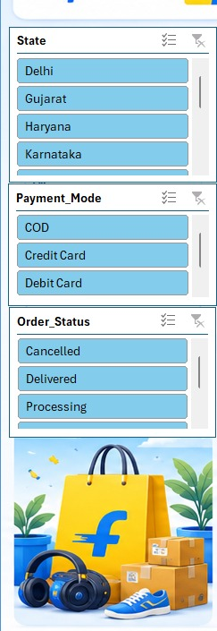
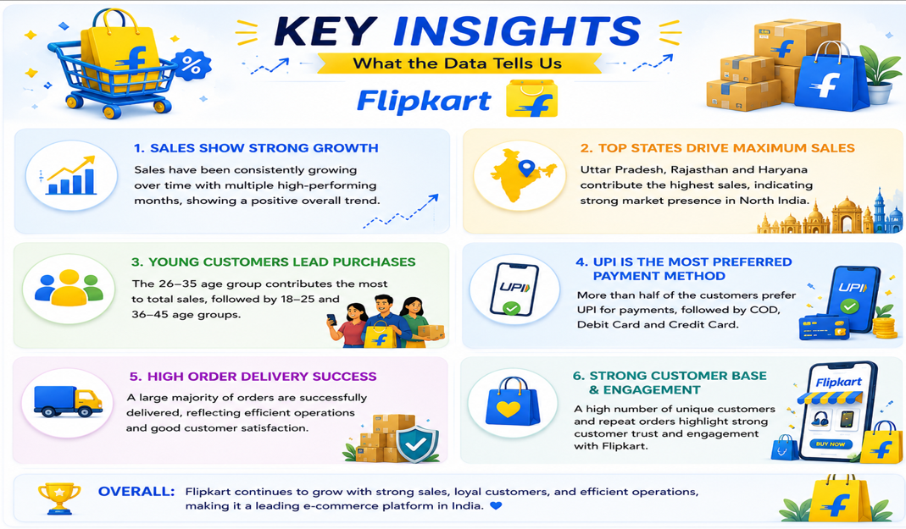

# 🛒 Flipkart Sales Dashboard — Excel Data Analytics Project

<p align="center">
  
</p>

<h3 align="center">📊 E-Commerce Performance Analysis using Microsoft Excel</h3>

<p align="center">
  <b>Data Cleaning • PivotTables • PivotCharts • Slicers • Dashboard Design • Business Insights</b>
</p>

---

## 📌 Project Overview

This project presents an interactive **Flipkart Sales Dashboard built in Microsoft Excel** to analyze e-commerce performance across sales, orders, customers, payment methods, states, and monthly trends.

The dashboard converts raw transactional data into an easy-to-understand business report with **KPI cards, interactive slicers, charts, a geographic view, and top-state analysis**.

The main objective was to create a professional BI-style Excel dashboard that can help a business quickly answer questions such as:

- 💰 How much total sales were generated?
- 📦 How many orders were placed?
- 👥 How many unique customers purchased?
- ⭐ What is the average customer rating?
- 📈 Which month generated the highest sales?
- 🗺️ Which states contribute the most sales and orders?
- 💳 Which payment mode is used most frequently?
- 🎯 Which customer age group contributes the most sales?

---

## 🎯 Business Objectives

| Objective | Analysis |
|---|---|
| 💰 Sales Performance | Analyze total sales and monthly sales trends |
| 📦 Order Performance | Understand total orders and state-wise order distribution |
| 👥 Customer Analysis | Compare sales across customer age groups |
| 💳 Payment Analysis | Identify the most-used payment methods |
| 🗺️ Geographic Analysis | Compare sales and orders across Indian states |
| ⭐ Customer Satisfaction | Track the overall average rating |
| 🔎 Interactive Analysis | Use slicers to filter the dashboard dynamically |

---

## 🧰 Tools & Technologies

- **Microsoft Excel**
- Excel Tables
- Data Cleaning
- Sorting & Filtering
- **PivotTables**
- **PivotCharts**
- **Slicers**
- KPI Cards
- Excel Dashboard Design
- Basic Business Analytics

---

## 📊 Dashboard KPIs

The dashboard highlights four primary performance indicators:

| KPI | Value |
|---|---:|
| 💰 Total Sales | **5,931M** |
| 🛒 Total Orders | **250K** |
| 👥 Unique Customers | **39,914** |
| ⭐ Average Rating | **4.40** |

> **Note:** KPI values are displayed in the dashboard using compact business-friendly formats such as M and K.

---

## 📈 Dashboard Components

### 1️⃣ Monthly Sales Trend

<p align="center">
  
</p>

The monthly trend tracks sales performance from **January to December**.

**Key observation:**  
📌 **June records the highest sales peak**, while most other months remain within a comparatively stable range.

---

### 2️⃣ State-Wise Total Sales

<p align="center">
  
</p>

The dashboard compares sales generated by different Indian states.

The highlighted leading states in the sales chart include:

- 🇮🇳 Uttar Pradesh
- 🇮🇳 Rajasthan
- 🇮🇳 Haryana
- 🇮🇳 Maharashtra
- 🇮🇳 Punjab

This helps identify high-performing geographic markets.

---

### 3️⃣ Sales by Customer Age Group

The dashboard compares sales contribution across customer age groups:

- 18–25
- 26–35
- 36–45
- 46–55
- 56–65
- 65+

📌 **26–35 is the strongest-performing age group** in the displayed analysis.

This can help businesses understand which customer segment contributes most to sales.

---

### 4️⃣ Payment Mode Analysis

The dashboard uses a doughnut chart to show the distribution of orders by payment mode.

| Payment Mode | Share |
|---|---:|
| 💳 UPI | **51%** |
| 💵 COD | **33%** |
| 💳 Debit Card | **12%** |
| 💳 Credit Card | **4%** |

📌 **UPI is the most-used payment mode**, accounting for more than half of the displayed orders.

---

### 5️⃣ Order Distribution Across States

<p align="center">
  
</p>

The geographic section provides a visual representation of order distribution across India.

### 🏆 Top States by Orders

| Rank | State | Orders |
|---:|---|---:|
| 1 | Uttar Pradesh | **38,742** |
| 2 | Maharashtra | **29,501** |
| 3 | Karnataka | **22,815** |
| 4 | Rajasthan | **22,103** |
| 5 | West Bengal | **18,256** |

📌 **Uttar Pradesh leads the displayed top-state order ranking.**

---

## 🎛️ Interactive Slicers

<p align="center">
  
</p>

The dashboard includes interactive slicers for:

- 🇮🇳 **State**
- 💳 **Payment Mode**
- 📦 **Order Status**

These filters allow users to dynamically explore the dashboard instead of looking at only one static view.

---

## 💡 Key Business Insights
<p align="center">
  
</p>

### 🔹 1. June is the strongest sales month
The monthly sales trend shows a clear peak in **June**, making it an important period for understanding seasonal demand and promotional activity.

### 🔹 2. UPI dominates payments
With **51%** of displayed orders, UPI is the leading payment method. This indicates strong adoption of digital payments among customers.

### 🔹 3. 26–35 is the strongest age segment
The **26–35** customer group contributes the highest sales in the displayed age-group analysis.

### 🔹 4. Uttar Pradesh leads state-wise orders
Uttar Pradesh ranks **#1 with 38,742 orders**, followed by Maharashtra and Karnataka.

### 🔹 5. The dashboard represents a large sales volume
The dashboard reports approximately **5,931M in total sales** and **250K total orders**, providing a high-level view of overall e-commerce performance.

### 🔹 6. Customer ratings are strong
The displayed **average rating of 4.40** suggests a generally positive customer experience.

---

## 🖼️ Dashboard Preview

<p align="center">
  
</p>

---

## 🔍 Project Workflow

```text
Raw E-Commerce Data
        ↓
Data Cleaning & Preparation
        ↓
Sorting / Filtering
        ↓
PivotTables
        ↓
PivotCharts
        ↓
Slicers & KPI Cards
        ↓
Dashboard Design
        ↓
Business Insights
```

---

## 📂 Suggested Repository Structure

```text
Flipkart-Sales-Dashboard/
│
├── README.md
│
├── Flipkart_Sales_Dashboard.xlsx
│
└── images/
    ├── dashboard_overview.jpeg
    ├── kpi_cards.jpeg
    ├── monthly_sales_trend.jpeg
    ├── state_wise_sales_and_top_states.jpeg
    ├── order_distribution_map.jpeg
    └── slicers.jpeg
```

> Keep the Excel workbook and the `images` folder in the **same GitHub repository**. The image paths used in this README are relative paths, so GitHub will display them automatically when the structure above is maintained.

---

## 🚀 How to Use the Dashboard

1. Download/open the Excel workbook.
2. Go to the dashboard sheet.
3. Use the **State** slicer to focus on specific states.
4. Use the **Payment Mode** slicer to compare payment behavior.
5. Use the **Order Status** slicer to analyze order outcomes.
6. Observe how the PivotCharts and KPI cards respond to the selected filters.
7. Use the insights section as a quick business summary.

---

## 📌 Skills Demonstrated

### Excel
- Data Cleaning
- Data Organization
- Sorting & Filtering
- PivotTables
- PivotCharts
- Slicers
- KPI Creation
- Dashboard Formatting
- Business Reporting

### Data Analytics
- Trend Analysis
- Geographic Analysis
- Customer Segmentation
- Payment Behavior Analysis
- Order Analysis
- KPI Analysis
- Business Insight Generation

---

## 👨‍💻 About the Project

This project was created as a **portfolio data analytics project** to demonstrate how Microsoft Excel can be used to transform e-commerce data into an interactive and visually engaging business dashboard.

The focus was not only on creating charts, but also on presenting the data in a way that makes important business patterns easy to identify.

---

## ⭐ Portfolio Highlights

**Project:** Flipkart Sales Dashboard  
**Category:** E-Commerce Data Analytics  
**Tool:** Microsoft Excel  
**Dashboard Type:** Interactive Business Intelligence Dashboard  
**Core Techniques:** PivotTables, PivotCharts, Slicers & KPI Analysis

---

## 📬 Connect

If you found this project useful or have suggestions for improving the dashboard, feel free to connect with me on GitHub or LinkedIn.

<p align="center">
  <b>📊 Turning data into insights, one dashboard at a time.</b>
</p>


